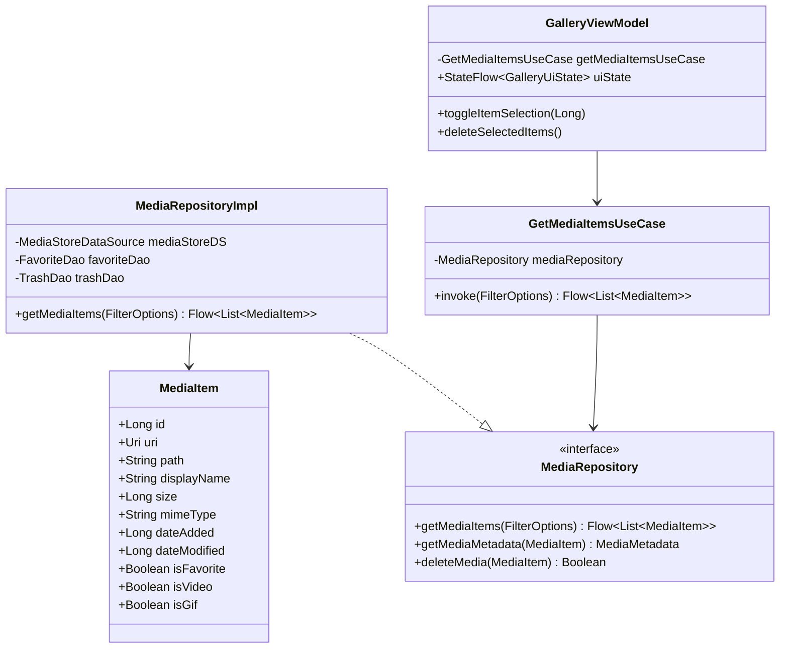
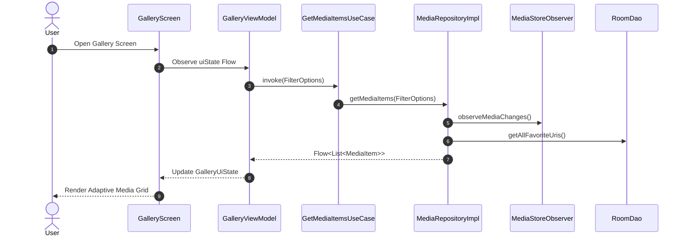
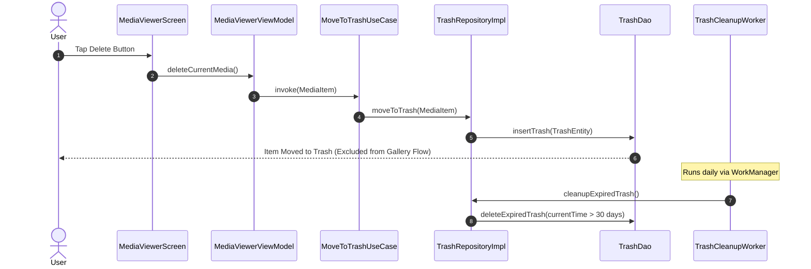

# Production-Grade Android Gallery Application Architecture

## 1. System Architecture Overview

The application follows **Strict Clean Architecture** combined with **MVVM (Model-View-ViewModel)** and **Jetpack Compose**. The codebase is decoupled into distinct architectural layers:

```mermaid
graph TD
    subgraph UI Layer
        ComposeScreens["Jetpack Compose Screens"]
        ViewModels["Hilt ViewModels"]
    end

    subgraph Domain Layer
        UseCases["Use Cases (GetMediaItems, MoveToTrash, etc.)"]
        Models["Domain Models (MediaItem, Album, TrashItem)"]
        RepoInterfaces["Repository Interfaces"]
    end

    subgraph Data Layer
        RepoImpls["Repository Implementations"]
        MediaStoreDS["MediaStore Data Source"]
        RoomDS["Room Local Database (Favorites, Trash)"]
        DataStoreDS["DataStore Preference Manager"]
        SAFHelper["Storage Access Framework"]
    end

    ComposeScreens --> ViewModels
    ViewModels --> UseCases
    UseCases --> RepoInterfaces
    RepoImpls ..|> RepoInterfaces
    RepoImpls --> MediaStoreDS
    RepoImpls --> RoomDS
    RepoImpls --> DataStoreDS
    RepoImpls --> SAFHelper
```

---

## 2. UML Class Diagram



---

## 3. Sequence Diagram: Media Query & Flow Stream



---

## 4. Sequence Diagram: Soft Delete & Trash Lifecycle



---

## 5. Architectural Principles & Best Practices
- **SOLID Principles**: Single Responsibility per UseCase, Interface Segregation for Repositories, Dependency Inversion with Hilt.
- **Unidirectional Data Flow (UDF)**: ViewModels expose immutable `StateFlow<UiState>` to Compose UI.
- **Asynchronous Coroutines & Flow**: Reactive data pipelines for MediaStore queries, Room updates, and DataStore preferences.
- **Scoped Storage & SAF**: Strict compliance with Android 13/14 visual media pickers and Storage Access Framework.
